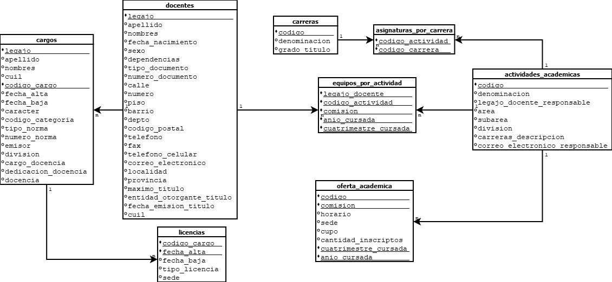

# db_basicas

En este repositorio se encuentran los scripts pasadores que alimentan la Base de Datos del Departamento de Ciencias Básicas (UNLu). A continuación se muestra el modelo de datos de la Base de datos, con sus tablas, atributos y relaciones:

